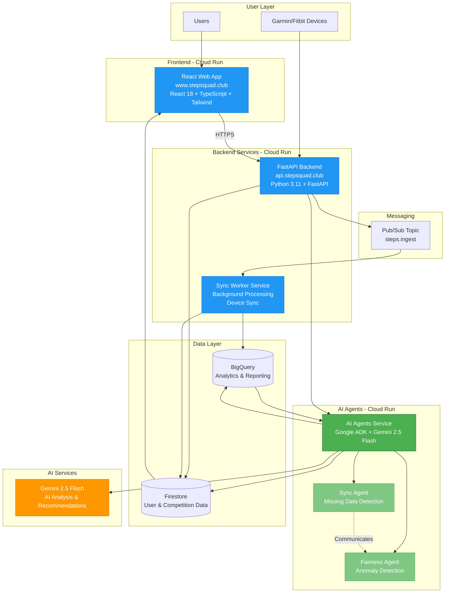
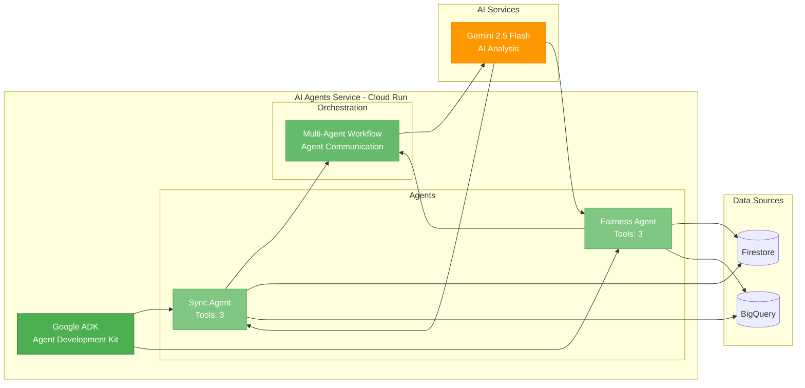
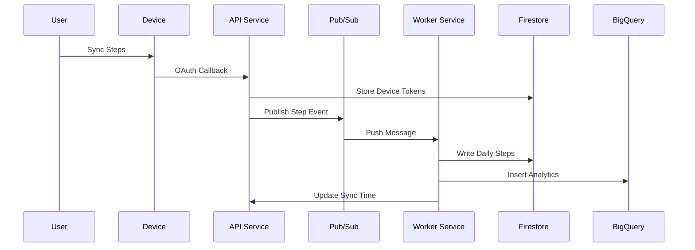
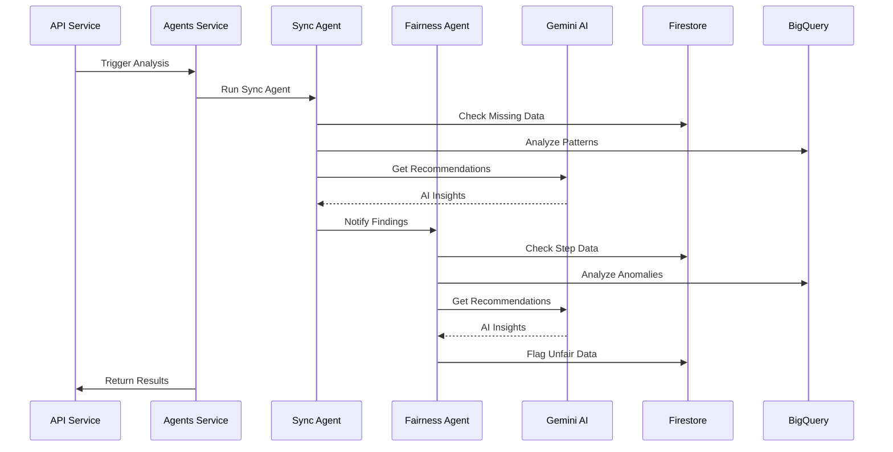
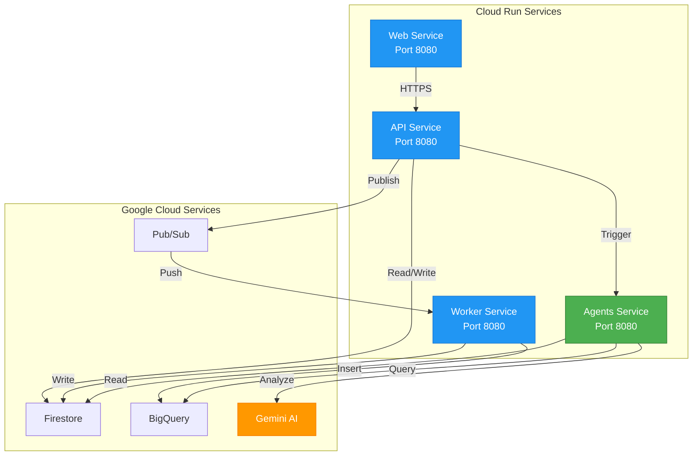
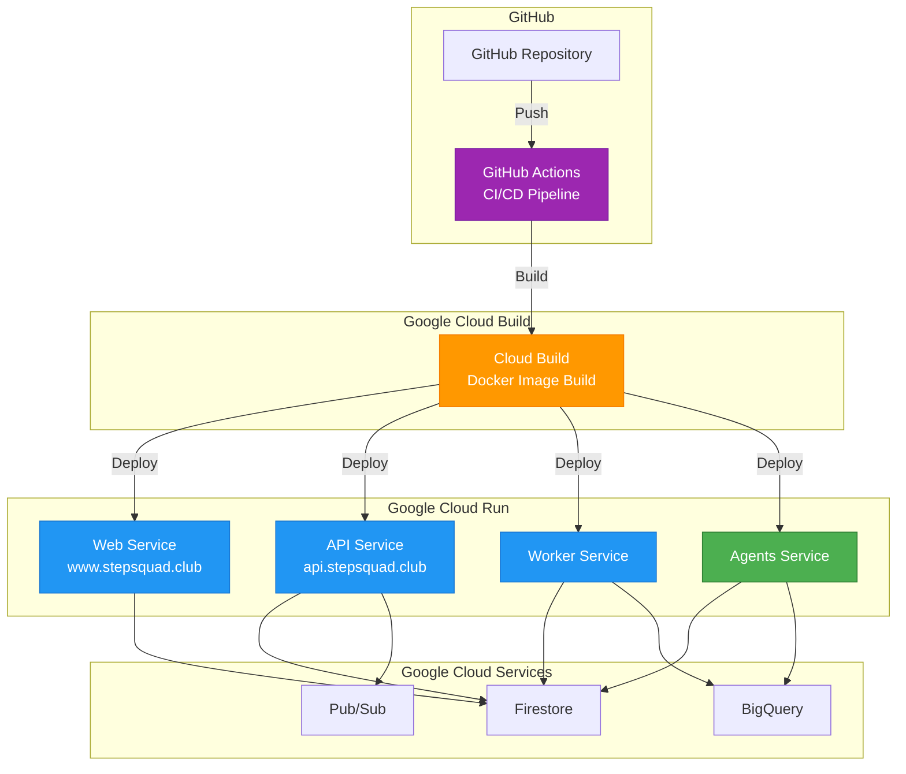

# StepSquad Architecture

## System Architecture

This document provides a detailed view of the StepSquad architecture, focusing on the multi-agent AI system built with Google ADK.

## High-Level Architecture

## AI Agents Architecture

## Data Flow Architecture

### Step Ingestion Flow

### AI Agent Analysis Flow

## Service Communication

## Technology Stack

### Frontend
- **Framework**: React 18
- **Build Tool**: Vite
- **Language**: TypeScript
- **Styling**: Tailwind CSS
- **State Management**: React Query
- **Authentication**: Firebase Authentication

### Backend
- **Framework**: FastAPI
- **Language**: Python 3.11
- **Authentication**: Firebase Admin SDK
- **Database**: Firestore
- **Analytics**: BigQuery

### AI Agents
- **Framework**: Google ADK (Agent Development Kit)
- **AI Model**: Gemini 2.5 Flash
- **Language**: Python 3.11
- **Orchestration**: Multi-agent workflows

### Infrastructure
- **Compute**: Google Cloud Run
- **Database**: Firestore (NoSQL)
- **Analytics**: BigQuery
- **Messaging**: Pub/Sub
- **CI/CD**: GitHub Actions
- **Domains**: Custom domains via Cloud Run

## Deployment Architecture

## Security Architecture

- **Authentication**: Firebase Authentication (JWT tokens)
- **Authorization**: Role-based access control (ADMIN, MEMBER)
- **API Security**: Firebase Admin SDK token verification
- **Network**: HTTPS only, Cloud Run managed certificates
- **Data**: Firestore security rules, encrypted at rest
- **Secrets**: Environment variables, Google Secret Manager

## Scalability

- **Horizontal Scaling**: Cloud Run auto-scales based on traffic
- **Database**: Firestore scales automatically
- **Messaging**: Pub/Sub handles high throughput
- **Caching**: React Query for frontend caching
- **Load Balancing**: Cloud Run managed load balancing

---

For more details, see:
- [ADK_IMPLEMENTATION.md](./ADK_IMPLEMENTATION.md) - AI Agents implementation details
- [HACKATHON_SUBMISSION.md](./HACKATHON_SUBMISSION.md) - Hackathon submission details

