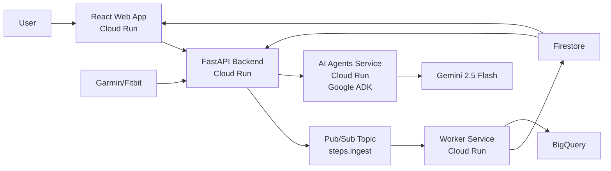

# StepSquad – Move Together, Win Together

## Inspiration

Our company recently launched a corporate wellness challenge using another step-tracking app — but we quickly discovered several issues: inaccurate syncing, missing charts, and even ways to cheat the rankings.  

So we decided to build **StepSquad**, a cleaner, fairer, data-driven platform designed for real-world team challenges.  

We're a small team of two engineers who love both fitness and software craftsmanship — and wanted to prove that an elegant, transparent solution could be built fast using Google Cloud Run and AI.

## What it does

StepSquad connects with **Garmin and Fitbit devices** via OAuth to collect verified step data during competitions.  

Each participant joins a **team**, and both **individual and team leaderboards** update in real-time.  

AI-powered **agents built with Google ADK** analyze the data using **Gemini 2.5 Flash** to detect anomalies (e.g., unrealistic spikes or suspicious patterns).  

The result: a fun, trustworthy competition experience for companies and communities.

## How we built it

The platform runs on a modern, cloud-native microservices architecture with **4 Cloud Run services**:

- **Frontend:** React 18 + Vite + TypeScript (web dashboard) deployed on Cloud Run with custom domain `www.stepsquad.club`

- **Backend API:** FastAPI (Python 3.11) served on Cloud Run with custom domain `api.stepsquad.club`

- **Workers Service:** Background worker on Cloud Run for syncing step data from linked devices via Pub/Sub

- **AI Agents Service:** Google ADK multi-agent system on Cloud Run with Sync Agent and Fairness Agent powered by Gemini 2.5 Flash

- **Data:** Firestore (user & competition data) + BigQuery (analytics)

- **Messaging:** Pub/Sub event pipeline between ingestion API and background workers

- **Infrastructure:** Automated CI/CD via GitHub Actions, custom domains configured

Architecture highlights:

## Challenges we ran into

- **Integrating multiple health APIs** (Garmin, Fitbit) with different OAuth flows and rate limits. Garmin uses OAuth 1.0a while Fitbit uses OAuth 2.0, requiring different handling.

- **Multi-agent orchestration** with Google ADK — ensuring agents communicate effectively while maintaining separation of concerns.

- **Handling timezone alignment** for competitions and daily resets across different regions.

- **Designing fairness detection logic** that's accurate but not too strict — using AI to balance human judgment with automated flagging.

- **Keeping the infrastructure lean** for hackathon speed while staying production-ready with proper authentication, error handling, and monitoring.

- **Deploying 4 separate Cloud Run services** with proper dependencies, environment variables, and custom domains.

## Accomplishments that we're proud of

- **End-to-end working prototype** with real cloud data ingestion, live leaderboards, and custom domains (`www.stepsquad.club` and `api.stepsquad.club`).

- **Multi-agent AI system** built with Google ADK meeting all hackathon requirements for the AI Agents category.

- **4 Cloud Run services** working together seamlessly: frontend, backend, workers, and AI agents.

- **Production-ready deployment** with automated CI/CD via GitHub Actions and Firebase Authentication.

- **Modern, responsive UI** built with React, TypeScript, and Tailwind CSS that looks great in any mode.

- **Building it all as a team of two** while working full-time elsewhere. 💪

## What we learned

We learned how to combine **serverless microservices** on Cloud Run with modern web frameworks in a matter of days.  

We mastered **Google ADK** for building multi-agent systems and saw how **Gemini 2.5 Flash** can provide intelligent analysis at scale.

We discovered that **wellness + gamification** can be done ethically and transparently, with technology supporting — not faking — real activity.

We learned the importance of **proper architecture** — separating concerns across services while maintaining clean communication patterns.

## What's next for StepSquad - Move Together, Win Together

- **Mobile app:** Build a Flutter mobile app with direct HealthKit and Health Connect sync.

- **Fairness engine expansion:** Enhance anomaly detection with more sophisticated AI-based scoring and pattern recognition.

- **Company dashboards:** Add analytics with charts, heatmaps, and trends over time using BigQuery.

- **Open challenges:** Enable public leaderboards for cities, events, and charity walks.

- **Smartwatch companion app:** Quick status and daily progress visualization.

- **Additional device integrations:** Support for more fitness trackers and health platforms.

---

Together, we believe every step — whether 5,000 or 50,000 — deserves to count, **fairly**.

