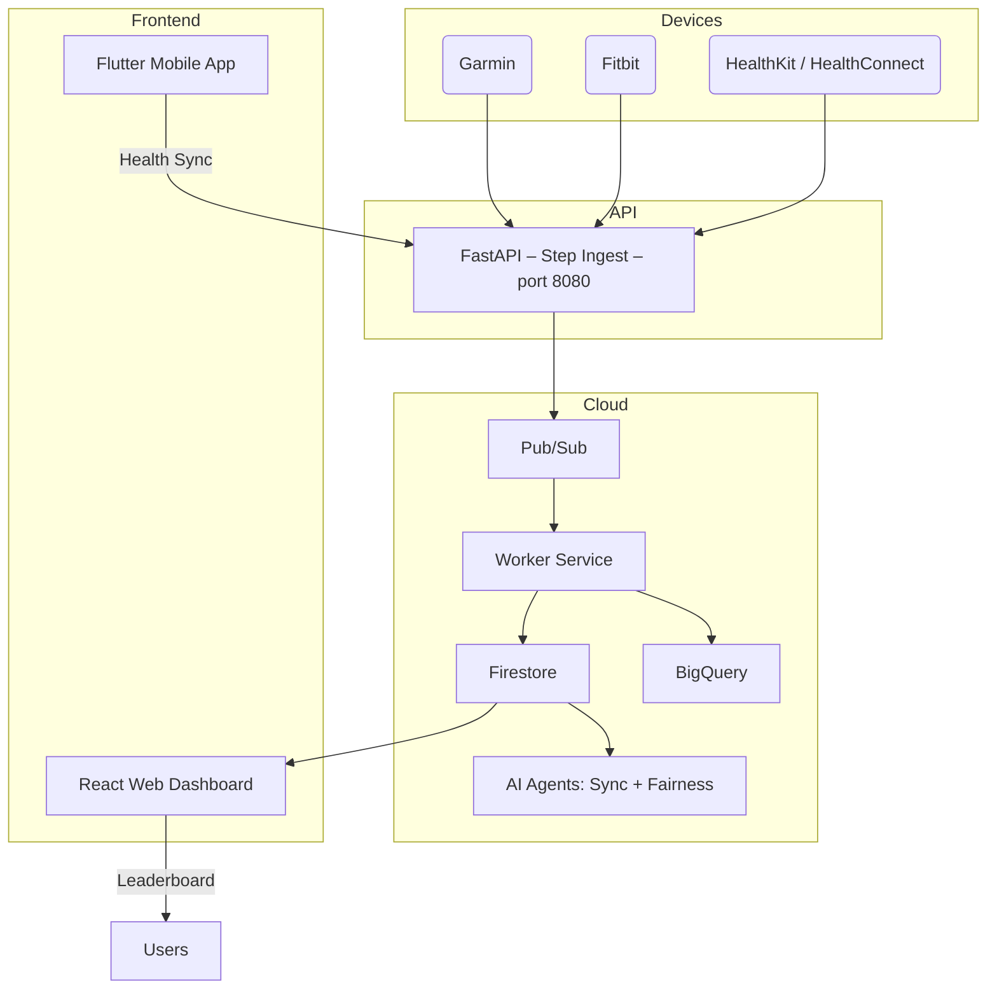

# 🏃‍♂️ StepSquad – Move Together, Win Together

**StepSquad** is a **team-based step competition platform** that connects with smartwatches and phone sensors (Garmin, Fitbit, HealthKit, and Health Connect) to create fair, transparent, and fun movement challenges.  
Built by two developers passionate about **fitness** and **clean architecture**, StepSquad shows how **AI + serverless design** can make wellness competitions smarter and more trustworthy.

📦 **Repo:** [https://github.com/datarake/stepsquad](https://github.com/datarake/stepsquad)

---

## 🌟 Features

- 👟 **Team creation & joining** — build or join teams for competitions  
- 🔄 **Automatic step ingestion** — via smartwatch integrations or manual sync  
- 🏆 **Daily & total leaderboards** — for individuals and teams  
- 🧠 **AI fairness detection** — flags unrealistic or fake data  
- ☁️ **Multi-cloud-ready architecture** — modular and serverless  
- ⚡ **Real-time aggregation** — Pub/Sub + Firestore + BigQuery pipeline  
- 🎮 **Gamified dashboards** — for individuals, teams, and companies  

---

## 🧩 Architecture Overview



### 🧱 Components

| Component | Tech | Description |
|------------|------|-------------|
| **API** | FastAPI (Python) | Step ingestion, teams, leaderboards |
| **Workers** | Python (GCP Pub/Sub consumer) | Processes step events, writes to Firestore + BigQuery |
| **Agents** | FastAPI (Python) | Runs fairness & sync jobs via Cloud Scheduler |
| **Web** | React + Vite | Real-time leaderboard UI |
| **Mobile** | Flutter | Optional companion app for live sync & notifications |

---

## 🧰 Built With

**Languages:** Python · TypeScript · Dart  
**Frameworks:** FastAPI · React (Vite) · Flutter  
**Cloud:** Google Cloud Run · Cloud Build · Cloud Storage  
**Data:** Firestore · BigQuery  
**Messaging:** Pub/Sub  
**Infrastructure:** Terraform  
**Auth:** OAuth2 (Garmin · Fitbit · Google Fit · Apple Health)  
**AI:** Google ADK (Agent Development Kit)  
**DevOps:** Docker · Make · GitHub Actions · uv · pnpm  
**Design:** Figma · Lucide Icons · Tailwind CSS  

---

## 🧑‍💻 Local Development

### 🧾 Prerequisites

- Docker + Docker Compose  
- Python ≥ 3.11 with `uv`  
- Node.js + `pnpm`  
- (Optional) Flutter SDK  

---

### 🚀 Run the entire stack locally

```bash
git clone https://github.com/datarake/stepsquad.git
cd stepsquad
make dev
```

This runs all containers via **Docker Compose**:

| Service | Local URL | Internal Port | Notes |
|----------|------------|---------------|-------|
| **API** | http://localhost:8004/docs | 8080 | FastAPI backend |
| **Web** | http://localhost:5173 | 5173 | React dashboard |
| **Workers** | – | 8080 | Pub/Sub consumer (local mode) |

💡 Inside Docker, every backend service still listens on **port 8080**,  
but locally Docker maps it to **8004** for the API so you can open it in your browser.

---

### 🧪 Seed demo data

```bash
curl -X POST http://localhost:8004/dev/seed
```

Then refresh the dashboard at **http://localhost:5173** to see example teams, users, and leaderboards.

---

### 🧩 Useful local commands

```bash
# Run only API locally (with live reload)
make api

# Run only Web
make web

# Run workers
make workers

# Rebuild and start all containers
make dev
```

---

## ☁️ Deployment (Google Cloud Run)

### 1️⃣ Authenticate and configure project

```bash
gcloud auth application-default login
gcloud config set project fluent-coder-476318-n0
```

### 2️⃣ Create infrastructure

```bash
cd infra/terraform
terraform init
terraform apply -var 'project_id=fluent-coder-476318-n0' -var 'region=europe-west1'
```

### 3️⃣ Create BigQuery schema

```bash
make bq_schema
```

### 4️⃣ Deploy all services

```bash
export GOOGLE_CLOUD_PROJECT=fluent-coder-476318-n0
export GCP_REGION=europe-west1

make deploy_api
make deploy_workers
make deploy_agents
make deploy_web
```

Each deployment:
- Builds the image with **Cloud Build**
- Pushes it to **Artifact Registry**
- Deploys to **Cloud Run (managed)**

### 5️⃣ Verify health of all services

```bash
make check_health
```

Expected output:

```
🔍 Checking StepSquad service health in region europe-west1...
✅ stepsquad-api: healthy (...)
✅ stepsquad-workers: healthy (...)
✅ stepsquad-agents: healthy (...)
✅ stepsquad-web: healthy (HTML frontend)
```

---

## ⚙️ Environment Variables

| Key | Description | Example |
|-----|--------------|----------|
| `COMP_TZ` | Competition timezone | `Europe/Bucharest` |
| `GRACE_DAYS` | Days allowed for late data | `2` |
| `GCP_ENABLED` | Local vs Cloud mode toggle | `true` |
| `GOOGLE_CLOUD_PROJECT` | GCP project ID | `fluent-coder-476318-n0` |
| `BQ_DATASET` | BigQuery dataset | `stepsquad` |
| `PUBSUB_TOPIC_INGEST` | Ingest topic name | `steps.ingest` |
| `PUBSUB_SUB_INGEST` | Worker subscription | `steps.ingest.sub` |
| `COMP_TZ` | Competition timezone | `Europe/Bucharest` |
| `PORT` | Internal runtime port (always 8080) | `8080` |

---

## 📁 Folder Structure

```
stepsquad/
├─ apps/
│  ├─ api/          # FastAPI backend (port 8080 internal / 8004 external)
│  ├─ workers/      # Pub/Sub consumer
│  ├─ agents/       # Sync & fairness jobs
│  ├─ web/          # React dashboard
│  └─ mobile/       # Flutter app (optional)
├─ infra/
│  ├─ terraform/    # IaC definitions
│  └─ bq/           # BigQuery schema scripts
├─ deploy/          # Cloud Run deploy scripts
├─ docker-compose.yml
├─ Makefile         # Local + Cloud automation
└─ README.md
```

---

## 🧭 Typical Workflows

### 💻 Local development cycle
1. Modify backend or web code  
2. `make dev` to rebuild locally  
3. Test via http://localhost:8004 and http://localhost:5173  
4. Commit changes to GitHub  

### ☁️ Cloud deployment cycle
1. Push commits → optionally trigger CI/CD  
2. Run:
   ```bash
   make deploy_api
   make deploy_workers
   make deploy_agents
   make deploy_web
   make check_health
   ```
3. Verify endpoints from the output URLs  

---

## 🚧 Roadmap
- ✅ Cloud-native MVP (FastAPI · Pub/Sub · Firestore · BigQuery)  
- 🚧 Add smartwatch integrations (Garmin / Fitbit / HealthKit)  
- 🚧 Fairness AI models  
- 🚧 Gamified dashboards & streak tracking  
- 🚧 Company-level reports  

---

## 👥 Contributors
- **Bogdan Burdalescu**  
- **Cristian Gheorghe**

---

## 📜 License
MIT License © 2025 StepSquad Team

---

> **Every step counts — fairly.** 🦶
