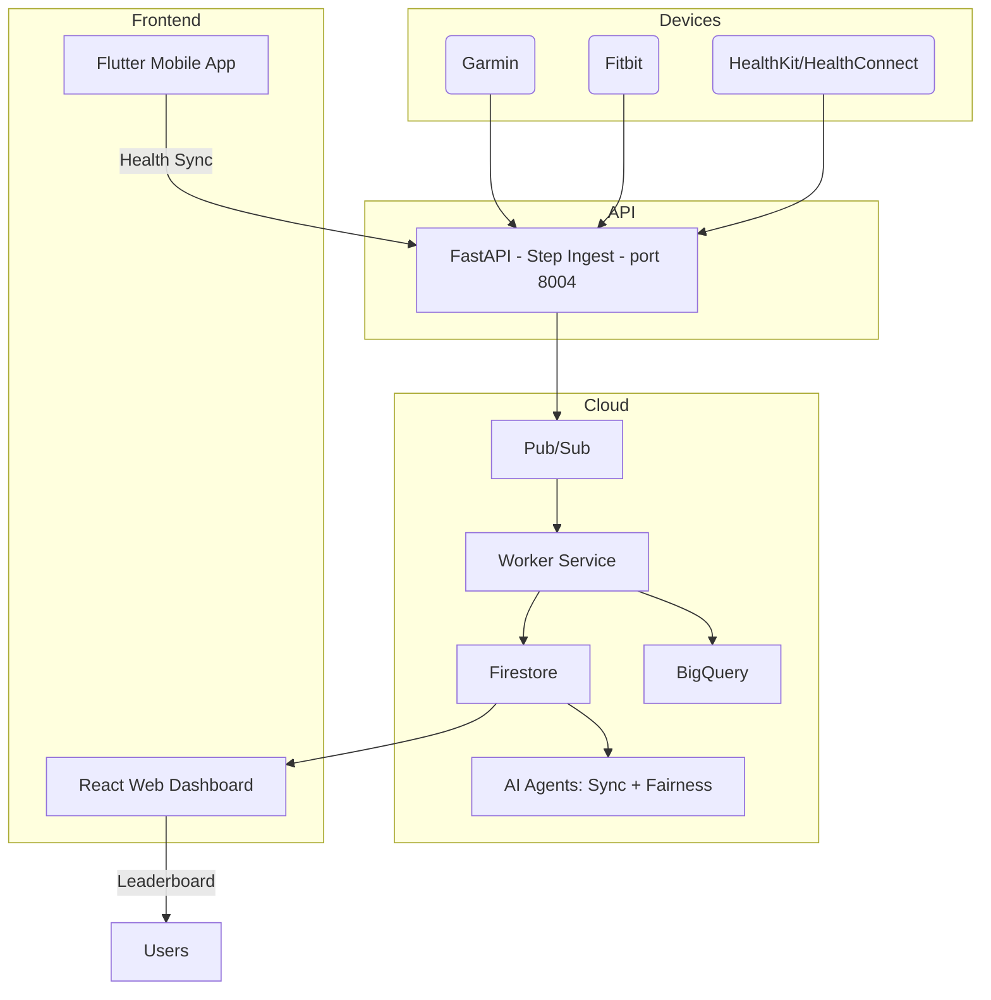

# StepSquad – Move Together, Win Together 🏃‍♂️🏃‍♀️

StepSquad is a **team-based step competition platform** that connects with smartwatches and phone sensors (Garmin, Fitbit, HealthKit, and Health Connect) to create fair, transparent, and fun movement challenges.  
Built by a team of two developers passionate about both **fitness** and **clean architecture**, StepSquad demonstrates how AI and cloud-native design can make wellness competitions smarter and more trustworthy.

Repo: https://github.com/datarake/stepsquad

---

## 🌟 Features
- **Team creation and joining** — build or join teams for competitions  
- **Automatic step ingestion** — via smartwatch integrations or manual sync  
- **Daily and total leaderboards** — for individuals and teams  
- **Anti-cheat detection** — AI fairness agents flag unrealistic data  
- **Multi-cloud-ready architecture** — serverless and modular  
- **Real-time aggregation** — Pub/Sub + Firestore + BigQuery pipeline  
- **Gamified dashboards** — for individuals, teams, and companies  

---

## 🧩 Architecture Overview



### Components
- **API (FastAPI)** – Handles step ingestion, team management, and leaderboards  
- **Workers (Python)** – Consumes Pub/Sub events, writes to Firestore and BigQuery  
- **Agents (FastAPI)** – Runs fairness and sync jobs via Cloud Scheduler  
- **Web (React)** – Real-time leaderboard and admin interface  
- **Mobile (Flutter)** – Step tracker integration and notifications  

---

## 🧰 Built With
- **Languages:** Python, TypeScript, Dart  
- **Frameworks:** FastAPI, React + Vite, Flutter  
- **Cloud Platform:** Google Cloud Run, Cloud Build, Cloud Storage  
- **Data & Analytics:** Firestore, BigQuery  
- **Messaging & Events:** Pub/Sub  
- **Infrastructure as Code:** Terraform  
- **Authentication:** OAuth2 (Garmin, Fitbit, Google Fit, Apple Health)  
- **AI & Automation:** Google ADK (Agent Development Kit)  
- **DevOps:** Docker, Make, GitHub Actions, uv, pnpm  
- **Design:** Figma, Lucide Icons, Tailwind CSS

---

## 🧑‍💻 Local Development

### Prerequisites
- Docker & Docker Compose  
- Python ≥3.11 + uv  
- Node.js + pnpm  
- Flutter SDK (optional, for mobile app)

### Run everything locally
```bash
# Clone and start
git clone https://github.com/datarake/stepsquad.git
cd stepsquad
make dev
```
This runs API + Web + Worker locally at:
- API → http://localhost:8004/docs  
- Web → http://localhost:5173

### Seed demo data
```bash
curl -X POST http://localhost:8004/dev/seed
```
Then refresh the web dashboard to see example users, teams, and leaderboards.

---

## ☁️ Deployment (Google Cloud)

### 1. Authenticate and set project
```bash
gcloud auth application-default login
gcloud config set project StepSquad
```

### 2. Create core resources
```bash
cd infra/terraform
terraform init
terraform apply -var 'project_id=StepSquad' -var 'region=europe-west1'
```

### 3. Create BigQuery schema
```bash
make bq_schema
```

### 4. Deploy services
```bash
export GOOGLE_CLOUD_PROJECT=StepSquad
export GCP_REGION=europe-west1

make deploy_api
make deploy_workers
make deploy_web
make deploy_agents
```

---

## ⚙️ Environment Variables

| Key | Description | Example |
|-----|--------------|----------|
| `COMP_TZ` | Competition timezone | `Europe/Bucharest` |
| `GRACE_DAYS` | Days allowed for late data | `2` |
| `GCP_ENABLED` | Toggle between local/in-cloud mode | `true` |
| `GOOGLE_CLOUD_PROJECT` | GCP project ID | `StepSquad` |
| `BQ_DATASET` | BigQuery dataset name | `stepsquad` |
| `PUBSUB_TOPIC_INGEST` | Ingest topic name | `steps.ingest` |
| `PUBSUB_SUB_INGEST` | Worker subscription | `steps.ingest.sub` |
| `PORT` | Runtime port for API/Agents | `8004` |

---

## 📁 Folder Structure

```
stepsquad/
├─ apps/
│  ├─ api/          # FastAPI backend (port 8004)
│  ├─ workers/      # Pub/Sub consumer workers
│  ├─ agents/       # Sync & Fairness agents
│  ├─ web/          # React web dashboard
│  └─ mobile/       # Flutter app (optional)
├─ infra/
│  ├─ terraform/    # Cloud infrastructure (IaC)
│  └─ bq/           # BigQuery schema + scripts
├─ deploy/          # gcloud deploy scripts
├─ packages/        # Shared code (py-common, ts-common)
├─ docker-compose.yml
├─ Makefile
└─ README.md
```

---

## 🚧 Roadmap
- ✅ Cloud-native MVP (FastAPI, Pub/Sub, Firestore, BigQuery)  
- 🚧 Add mobile integrations (Garmin, Fitbit, HealthKit)  
- 🚧 Fairness engine AI models  
- 🚧 Gamified dashboards & streak tracking  
- 🚧 Company-level reporting

---

## 👥 Contributors
- **Bogdan Burdalescu**
- **Cristian Gheorghe**

---

## 📜 License
MIT License © 2025 StepSquad Team

---

**Every step counts — fairly.**
