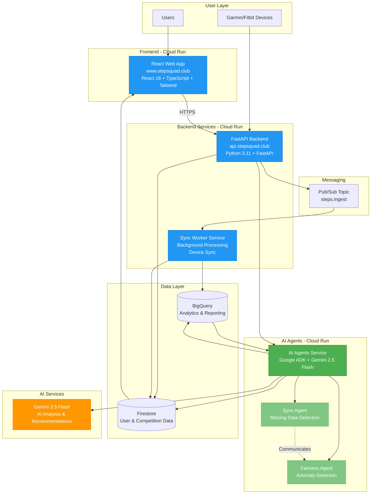

# StepSquad - Move Together, Win Together

> A fitness competition platform powered by **Google ADK (Agent Development Kit)** and **Gemini AI** for the [Google Cloud Run Hackathon](https://run.devpost.com/) - **AI Agents Category**

[](https://www.stepsquad.club)
[](https://google.github.io/adk-docs/)
[](https://ai.google.dev/)

## 🎯 Overview

StepSquad is a fitness competition platform that brings teams together to compete in step challenges. Built with **Google ADK (Agent Development Kit)** and **Gemini 2.5 Flash**, it features a **multi-agent AI system** that ensures fair competition through automated data synchronization and anomaly detection.

### Key Features

- 🏃 **Team-Based Competitions**: Create and join teams to compete in step challenges
- 📊 **Real-Time Leaderboards**: Individual and team leaderboards that update in real-time
- 🔗 **Device Integration**: OAuth integration with Garmin and Fitbit devices
- 🤖 **AI-Powered Fairness**: Multi-agent system detects anomalies and ensures fair competition
- 📱 **Modern UI**: Responsive web application built with React and TypeScript
- ☁️ **Cloud-Native**: Fully deployed on Google Cloud Run with custom domains

## 🤖 AI Agents Category - Hackathon Submission

This project participates in the **AI Agents Category** of the Google Cloud Run Hackathon, meeting all requirements:

### ✅ Hackathon Requirements Met

- ✅ **Built with Google ADK**: Multi-agent system using Google's Agent Development Kit
- ✅ **Deployed to Cloud Run**: All services deployed on Google Cloud Run
- ✅ **Multi-Agent Application**: Two AI agents working together (Sync Agent & Fairness Agent)
- ✅ **Agent Communication**: Agents communicate via orchestrated workflows
- ✅ **Real-World Problem**: Solves fairness and data synchronization issues in fitness competitions

### 🤖 AI Agents Implementation

#### 1. **Sync Agent**
- **Purpose**: Detects missing step data and triggers synchronization workflows
- **Tools**:
  - `check_missing_data` - Detects users who haven't submitted data
  - `check_late_data` - Identifies data submitted after competition end
  - `notify_fairness_agent` - Communicates with fairness agent
- **AI Integration**: Uses Gemini 2.5 Flash for intelligent recommendations

#### 2. **Fairness Agent**
- **Purpose**: Analyzes step data for anomalies and flags unrealistic entries
- **Tools**:
  - `analyze_step_data` - Detects unrealistic step counts (>50k/day)
  - `flag_unfair_data` - Flags suspicious entries for admin review
  - `check_patterns` - Detects suspicious patterns (identical values, round numbers)
- **AI Integration**: Uses Gemini 2.5 Flash for pattern analysis and recommendations

#### 3. **Multi-Agent Workflow**
- **Orchestration**: Coordinates both agents in sequence
- **Communication**: Agents communicate via tools and shared workflows
- **Intelligence**: Combined AI analysis provides comprehensive insights

For detailed implementation, see [ADK_IMPLEMENTATION.md](./ADK_IMPLEMENTATION.md)

## 🏗️ Architecture

### System Architecture Diagram



### Service Architecture

The platform consists of **4 Cloud Run services** working together:

1. **Frontend Service** (`apps/web`)
   - React 18 + Vite + TypeScript
   - Tailwind CSS for styling
   - Firebase Authentication
   - React Query for state management
   - **Deployment**: Cloud Run (custom domain: `https://www.stepsquad.club`)

2. **Backend API Service** (`apps/api`)
   - FastAPI (Python 3.11)
   - Firebase Admin SDK for authentication
   - Firestore for data storage
   - OAuth integration (Garmin, Fitbit)
   - **Deployment**: Cloud Run (custom domain: `https://api.stepsquad.club`)

3. **Workers Service** (`apps/workers`)
   - Background processing for device synchronization
   - Pub/Sub message processing
   - Daily step sync from linked devices
   - **Deployment**: Cloud Run

4. **AI Agents Service** (`apps/agents`)
   - Google ADK (Agent Development Kit)
   - Gemini 2.5 Flash for AI analysis
   - Multi-agent orchestration
   - **Deployment**: Cloud Run

### Data Flow

1. **Step Ingestion**:
   - User connects device (Garmin/Fitbit) via OAuth
   - API receives step data and publishes to Pub/Sub
   - Worker processes messages and stores in Firestore/BigQuery

2. **AI Analysis**:
   - Agents service periodically analyzes competition data
   - Sync Agent detects missing/late data
   - Fairness Agent detects anomalies and suspicious patterns
   - Agents communicate findings and provide AI-powered recommendations

3. **Leaderboard Updates**:
   - Frontend queries API for latest data
   - API aggregates data from Firestore
   - Real-time updates via React Query

## 🚀 Features

### Core Features

- ✅ **User Management**: Role-based access control (ADMIN, MEMBER)
- ✅ **Competition Management**: Create, view, update competitions with status workflow
- ✅ **Team Management**: Create teams, join/leave teams, team renaming
- ✅ **Step Ingestion**: Manual entry, device sync, and virtual step generator (for demos)
- ✅ **Leaderboards**: Individual and team leaderboards with real-time updates
- ✅ **Device Integration**: OAuth integration with Garmin and Fitbit
- ✅ **Virtual Device**: Step generator for hackathon demonstrations

### AI-Powered Features

- ✅ **Automated Sync Detection**: AI agent detects missing step data
- ✅ **Fairness Checks**: AI agent detects suspicious patterns in step data
- ✅ **Multi-Agent Workflow**: Orchestrated agents for comprehensive validation
- ✅ **AI Recommendations**: Gemini AI provides intelligent insights and recommendations

### Infrastructure

- ✅ **Custom Domains**: `www.stepsquad.club` and `api.stepsquad.club`
- ✅ **CI/CD**: Automated deployment via GitHub Actions
- ✅ **Firebase Authentication**: Production-ready authentication
- ✅ **Firestore Database**: Scalable NoSQL database
- ✅ **BigQuery**: Analytics and reporting
- ✅ **Pub/Sub**: Event-driven architecture

## 📁 Project Structure

```
stepsquad/
├── apps/
│   ├── api/              # FastAPI backend service
│   ├── web/              # React frontend service
│   ├── agents/           # Google ADK AI agents service
│   └── workers/          # Background worker service
├── .github/
│   └── workflows/        # CI/CD pipelines
├── infra/                # Infrastructure as code
├── ADK_IMPLEMENTATION.md  # Detailed AI agents documentation
├── HACKATHON_SUBMISSION.md  # Hackathon submission details
└── README.md             # This file
```

## 🔧 Development

### Prerequisites

- Node.js 18+ and pnpm
- Python 3.11+ and uv
- Google Cloud SDK (gcloud)
- Firebase project setup
- Google ADK SDK (for agents development)

### Local Development

#### Backend
```bash
cd apps/api
uv sync
uv run uvicorn main:app --host 0.0.0.0 --port 8080 --reload
```

#### Frontend
```bash
cd apps/web
pnpm install
pnpm dev
```

#### AI Agents Service
```bash
cd apps/agents
uv sync
uv run uvicorn main:app --host 0.0.0.0 --port 8081 --reload
```

#### Workers Service
```bash
cd apps/workers
uv sync
uv run uvicorn worker:app --host 0.0.0.0 --port 8082 --reload
```

### Environment Setup

See `apps/api/env.local.example` for configuration options.

Required environment variables:
- `GCP_ENABLED=true`
- `GOOGLE_CLOUD_PROJECT=your-project-id`
- `FIREBASE_PROJECT_ID=your-firebase-project-id`
- `GEMINI_API_KEY=your-gemini-api-key` (for AI agents)

## 🧪 Testing

### Frontend
```bash
cd apps/web
pnpm test              # Unit tests
pnpm test:e2e          # E2E tests
pnpm test:coverage     # Coverage report
```

### Backend
```bash
cd apps/api
uv run pytest          # Run all tests
uv run pytest -v       # Verbose output
```

### AI Agents
```bash
cd apps/agents
uv run pytest          # Run agent tests
```

## 🚀 Deployment

### CI/CD

Deployments are automated via GitHub Actions:
- Push to `main` triggers deployment
- All services deployed to Cloud Run
- Custom domains configured automatically

### Manual Deployment

See individual service READMEs for deployment instructions.

## 🌐 Production URLs

- **Frontend**: https://www.stepsquad.club
- **Backend API**: https://api.stepsquad.club
- **API Documentation**: https://api.stepsquad.club/docs

## 📚 Documentation

- **API Documentation**: Available at `/docs` endpoint (Swagger UI)
- **AI Agents Documentation**: See [ADK_IMPLEMENTATION.md](./ADK_IMPLEMENTATION.md)
- **Hackathon Submission**: See [HACKATHON_SUBMISSION.md](./HACKATHON_SUBMISSION.md)
- **Code Documentation**: Inline comments and docstrings

## 🏆 Hackathon Submission

**Built for**: [Google Cloud Run Hackathon](https://run.devpost.com/) - **AI Agents Category**

### Key Highlights

- ✅ **Google ADK Integration**: Multi-agent system built with Google's Agent Development Kit
- ✅ **Gemini AI**: Uses Gemini 2.5 Flash for intelligent analysis and recommendations
- ✅ **Multi-Agent Workflow**: Two agents (Sync & Fairness) working together with communication
- ✅ **Production-Ready**: Fully deployed with custom domains and CI/CD
- ✅ **Real-World Solution**: Solves fairness and data synchronization in fitness competitions
- ✅ **Cloud-Native**: 4 Cloud Run services with event-driven architecture

### Technology Stack

- **Frontend**: React 18, TypeScript, Vite, Tailwind CSS
- **Backend**: FastAPI, Python 3.11
- **AI Agents**: Google ADK, Gemini 2.5 Flash
- **Database**: Firestore, BigQuery
- **Messaging**: Pub/Sub
- **Infrastructure**: Cloud Run, GitHub Actions
- **Authentication**: Firebase Authentication

## 🤝 Contributing

1. Create a feature branch
2. Make your changes
3. Run tests
4. Submit a pull request

## 📝 License

[Add your license here]

---

**StepSquad** - Move Together, Win Together 🏃‍♂️🏃‍♀️
